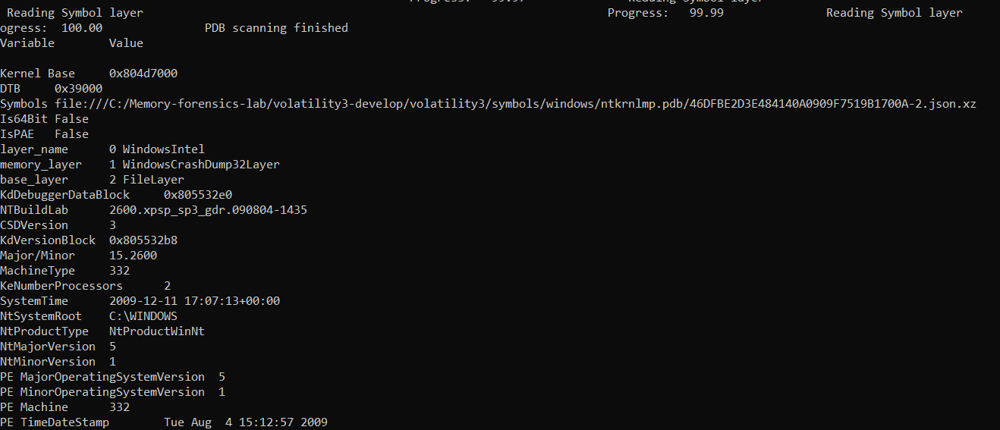
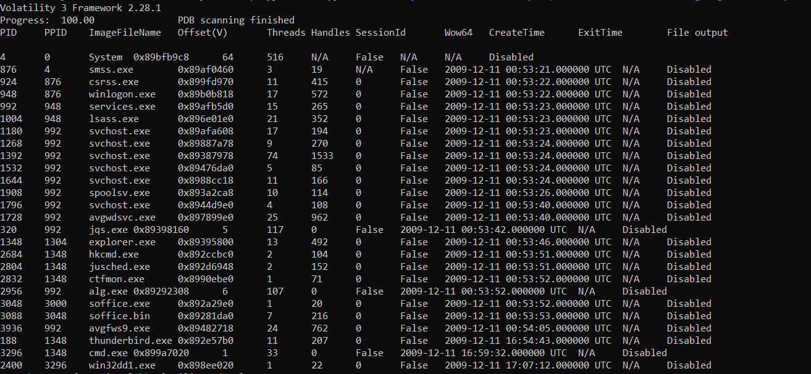
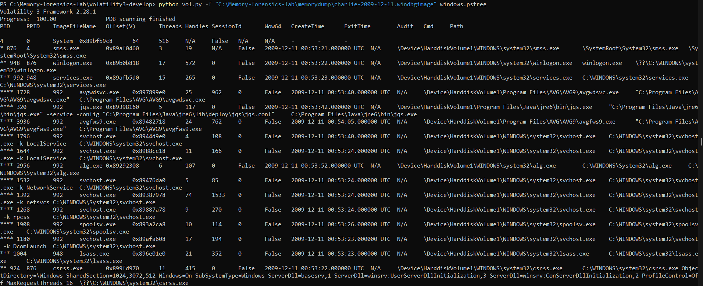

# Windows Memory Forensics Lab using Volatility 3

A beginner-friendly Digital Forensics and Incident Response (DFIR) project demonstrating Windows memory analysis using Volatility 3.

This project focuses on identifying operating system information, running processes, and process hierarchy from a Windows memory image.

---

## Objective

Learn the fundamentals of memory forensics by analyzing a Windows memory dump using Volatility 3.

---

## Lab Environment

- Windows 11
- Python
- Volatility 3
- Windows Memory Image (Charlie Sample)

---

## Sample Used

The memory sample was obtained from the official Volatility Foundation sample collection.

https://github.com/volatilityfoundation/volatility/wiki/Memory-Samples

Memory Image:

```
charlie-2009-12-11.windbgimage
```

---

## Project Workflow

1. Install Python
2. Download Volatility 3
3. Download Windows memory image
4. Verify image information
5. Enumerate running processes
6. Analyze parent-child process relationships
7. Document findings

---

## Commands Used

### Windows Information

```bash
python vol.py -f "memorydump\charlie-2009-12-11.windbgimage" windows.info
```

### Running Processes

```bash
python vol.py -f "memorydump\charlie-2009-12-11.windbgimage" windows.pslist
```

### Process Tree

```bash
python vol.py -f "memorydump\charlie-2009-12-11.windbgimage" windows.pstree
```

---

## Screenshots

### Windows Information



---

### Running Processes



---

### Process Tree



---

## Findings

The memory image analysis identified:

- Windows operating system information
- Kernel information
- Active system processes
- Parent-child process hierarchy
- Running user applications
- Installed antivirus processes

No malware execution was observed during this introductory analysis.

---

## Skills Learned

- Memory Forensics
- Volatility 3
- Windows Process Analysis
- Process Tree Investigation
- DFIR Methodology
- Incident Documentation

---

## References

Volatility Foundation

https://github.com/volatilityfoundation/volatility3

Memory Samples

https://github.com/volatilityfoundation/volatility/wiki/Memory-Samples
